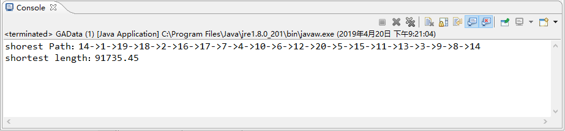

# INFO6205_527
## Genetic algorithms for the TSP problem  
#### Name:	Weiyi Lan 001822514  
#### Wen Zhong 001495774  
#### Advisor: Dr. Robin Hillyard  
### Problem description:  
The travelling salesman problem (TSP ) asks the following question: "Given a list of cities and the distances between each pair of cities, what is the shortest possible route that visits each city and returns to the origin city?" It is an NP-hard problem in combinatorial optimization, important in operations research and theoretical computer science.
The travelling purchaser problem and the vehicle routing problem are both generalizations of TSP.

### Program structure:
  
#### Four java file and one test case:  
#### GA.java  
  
#### GAData.java  
  
#### Individual.java  
  
#### Population.java  

### Structure in each java file (Code Analysis):  
#### GAData.java:
Set the parameters and the cityPosition map.
#### Individual.java:
Set the gene, distance and the fitness.  
Use the greedy algorithm  		
		
	do
	{
		cityNum++;

		//the shortest city
		float minDis=Integer.MAX_VALUE;
		int minCity=0;
		for(j=0;j<GAData.CITY_NUM;j++)
		{
			if(j != i)
			{
				//repeat or not
				boolean repeat=false;
				for(int n=0;n<cityNum;n++)
				{
					if(Integer.parseInt(genes[n]) == j+1)
					{
						repeat=true;
						break;
					}
				}
				if(repeat == false)
				{
					if(GAData.disMap[i][j] < minDis)
					{
						minDis=GAData.disMap[i][j];
						minCity=j;
					}
				}
			}
		}
	}
#### Population.java:  
Set the head point and the species number.  

#### GA algorithm java:  
run: run the algorithm  
createBeginningSpecies: create the species  
calFitness: calculate the fit rate of each species to be chosen  
select: roulette strategy for choosing the species with high fitting.  
crossover: chromosome crossover  
mutate: chromosome mutation  
getBest: get the most suitable species  
### User Guide:
	static int CITY_NUM; // number of citys  
	static final int SPECIES_NUM = 200; // number of species  
	static final int GENERATE_NUM = 10000; // number of generation  
	static final float pcl=0.6f, pch = 0.95f; // number of crossover  
	static final float pm=0.4f; // number of mutation  
	static final float[][] disMap; // data of map  

We can set the parameters to get the different results.  
 
Then set the city position, just like the coordinate, take 10 cities as an example, we set the 10 different positions into an array and get to result.  
10 cities:  

	int[][] city1={{0,0},{12,32},{5,25},{8,45},{33,17},
		{25,7},{15,15},{15,25},{25,15},{41,12}};
				  
20 cities:

	int[][] city2={{60,100},{280,200},{90,180},{150,180},
		{30,150},{110,130},{250,180}, {170,130},
		{60,150},{120,140},{160,140},{40,60},
		{130,90},{180,60},{30,50},{200,50},
		{240,70},{40,40},{70,30},{170,30}};

31 cities:

	int[][] city3={{1303, 2311}, {3638, 1315},         
		{4176, 2243}, {3711, 1398},            
		{3487, 1534}, {3325, 1555},         
		{3237, 1228}, {4195, 1003},         
		{4311, 789}, {4385, 569},
		{3006, 1969}, {2561, 1755},
		{2787, 1490}, {2380, 1675},
		{1331, 694}, {3714, 1677},
		{3917, 2178}, {4060, 2369},
		{3779, 2211},{3675, 2577},
		{4028, 2837},{4262, 2930},
		{3428, 1907},{3506, 2366},
		{3393, 2642},{3438, 3200},
		{2934, 3239},{3139, 3549},
		{2544, 2356},{2777, 2825},
		{2369, 2974}};
  
We can also get from random map  

	public static void main(String[] args) {
		CITY_NUM = 20;
		int[][] map = new int[CITY_NUM][CITY_NUM];
		int MAX_DISTANCE = 20000;
		//Create a random map
		for (int i = 0; i < CITY_NUM; i++) {
		    for (int j = 0; j < CITY_NUM; j++) {
			if (i < j) {
				map[i][j] = (int) (Math.random() * MAX_DISTANCE);
				map[j][i] = map[i][j];
			}
		    }
		}  
		runGA(map).printRate();
	}

### Test Result:   
The test result is to find the shorest path. All the data variables in the GAData.java could be alternatively changed by users to get the desire result. The Unit test are created by taking three different user input to pass into our data structure java files. Then, run the genetic algorithm to get the shorest path and distance. 
#### Result from Unit Test:  
  
#### Result from main():  

